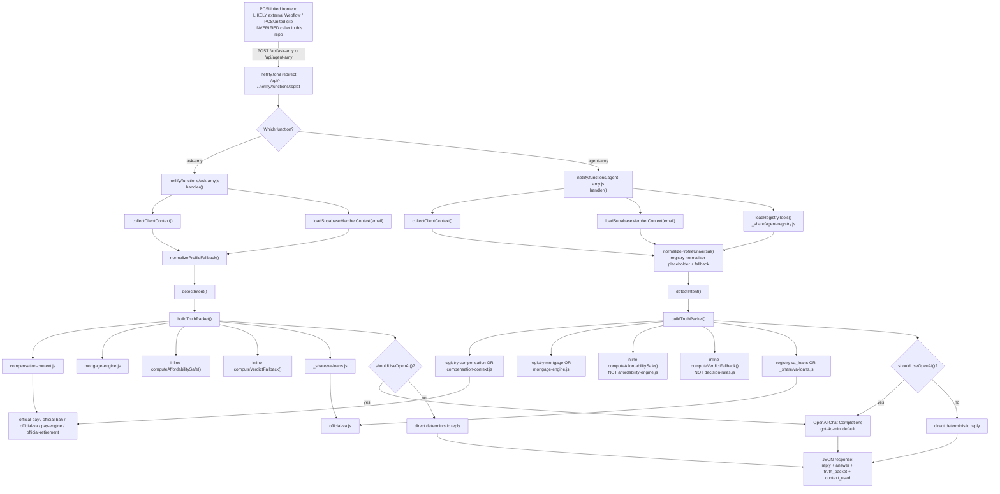

# Ask Amy Official Architecture Review

**Document status:** Official review (inspection only — no production code changes)  
**Repository:** TheWing.ai (`thewing-ai`)  
**Review date:** 2026-07-22  
**Primary candidate endpoint:** `netlify/functions/agent-amy.js`  
**Legacy / current named endpoint:** `netlify/functions/ask-amy.js`

**Evidence labels used throughout:**

| Label | Meaning |
|---|---|
| **VERIFIED** | Confirmed by repository code and/or local Node execution |
| **LIKELY** | Strongly implied by repository evidence; runtime/production not fully proven from this repo alone |
| **UNVERIFIED** | Cannot be confirmed from this repository |

---

## 1. EXECUTIVE SUMMARY

### What currently powers Ask Amy

Ask Amy is powered by two nearly parallel Netlify Functions that share the same product pattern:

1. Collect frontend profile/bridge/dashboard context.
2. Optionally enrich from Supabase by email using a service-role key.
3. Normalize a member profile.
4. Detect intent.
5. Build a deterministic **truth packet** (compensation, mortgage, affordability, verdict, VA loan).
6. Optionally call OpenAI as a conversational explanation layer.
7. Return `reply`, structured `answer`, `truth_packet`, and `context_used`.

Shared deterministic engines live under `netlify/functions/_share/`. Official military-data modules (`official-*.js`) sit behind higher-level engines such as `compensation-context.js`, `va-loans.js`, and `pcs-move-engine.js`.

### Which endpoint is live

| Endpoint | Repo status | Production caller status |
|---|---|---|
| `ask-amy.js` | Present, complete, documented as production-style Ask Amy (`v1.3.1`) | **UNVERIFIED** from this repo — no frontend caller exists here |
| `agent-amy.js` | Present, experimental registry fork (`v1.4.0`) | **UNVERIFIED** from this repo — no frontend caller exists here |

**VERIFIED:** Netlify redirect `/api/*` → `/.netlify/functions/:splat` (`netlify.toml:11-14`) exposes both `/api/ask-amy` and `/api/agent-amy` if the functions are deployed.

**VERIFIED:** This repository contains **no frontend Ask Amy widget, Resources page embed, or footer script** that calls either endpoint. CORS allowlists in both Amy handlers include `pcsunited.com` and PCSUnited Webflow origins (`agent-amy.js:64-87`), which makes an external Webflow/PCSUnited frontend **LIKELY**.

**LIKELY current named production endpoint:** `ask-amy.js`, based on header comments claiming the production URL and `agent-amy.js` explicitly labeling itself experimental and instructing maintainers to leave `ask-amy.js` untouched (`ask-amy.js:1-18`, `agent-amy.js:6-10`).

### Should `agent-amy.js` become the official endpoint?

**Yes — as the intended target architecture.**  
**No — not yet as a drop-in production cutover.**

### Production-ready?

**Conditional: No for official cutover today.**

`agent-amy.js` is a strong candidate and already improves several product behaviors (compensation OpenAI suppression, better missing-input handling for pay questions, registry scaffolding). It is **not** production-ready as the sole official intelligence engine until registry contract bugs, security controls, shared-engine wiring, and response-contract stability are addressed.

### Largest immediate risks

1. **Critical — unauthenticated email-based Supabase enrichment** using service-role credentials (`agent-amy.js:288-290`, `808-846`; same pattern in `ask-amy.js`).
2. **High — OpenAI can still invent or contradict numbers** because enforcement is prompt-only; model reply becomes public `reply` (`agent-amy.js:413`, `3672-3678`, `3741-3780`).
3. **High — registry is only partially wired** and contains hard export/normalization mismatches (`decision-rules` expected exports wrong; mortgage packet drops P&I/taxes).
4. **High — caller-controlled `debug: true` exposes email/scenario** (`agent-amy.js:264`, `1722-1735`).
5. **High — massive duplication** between `ask-amy.js` and `agent-amy.js` means behavior will drift silently during migration.

### Recommended first action

**Phase 0 protect-then-migrate:** confirm the live PCSUnited frontend caller URL (outside this repo), lock security around email/Supabase access, and do **not** retire `ask-amy.js` until a contract-compatible cutover checklist passes.

---

## 2. VERIFIED CURRENT ARCHITECTURE

### Runtime flow (actual files)



### Desired long-term direction vs verified today

| Desired layer | Desired owner | Verified today |
|---|---|---|
| PCSUnited frontend | PCSUnited | **UNVERIFIED** in this repo |
| Public Amy endpoint | `agent-amy.js` | Candidate only; experimental |
| Tool switchboard | `agent-registry.js` | Partially used; `buildToolPackets()` not used by Amy handler |
| Deterministic engines | `_share/*` | Partially used; affordability/decision still inline in Amy |
| Truth packet | Amy orchestration | Built inside endpoint, not fully registry-driven |
| OpenAI explanation | OpenAI | Used after deterministic packet; reply not schema-validated |
| Ask Amy response | PCSUnited UI | Renderer not present in this repo |

### Important architecture facts

- **VERIFIED:** `agent-amy.js` does **not** call `agentRegistry.buildToolPackets()` or `buildDirectToolReply()`; it only uses the registry as a tool loader (`agent-amy.js:93-235`, `266`).
- **VERIFIED:** Affordability and decision rules remain inline inside both Amy endpoints even though shared modules exist (`agent-amy.js:1667-1682`, `2546-2675`; `ask-amy.js:1463-1479`).
- **VERIFIED:** `pcs-move-engine.js` is used by `pcs-move.js`, not by Amy.
- **VERIFIED:** `response.js` is CommonJS and unused by Amy.
- **VERIFIED:** `official-bjs.js` does **not** exist in this repository.

---

## 3. ENDPOINT STATUS

### `ask-amy.js`

**Classification:** Active (deployable) · Legacy-candidate · **Not safe to retire**

Evidence:

- Header identifies it as the Ask Amy production-style endpoint and documents `POST https://thewing.netlify.app/api/ask-amy` (`ask-amy.js:1-18`).
- Complete handler, Supabase enrichment, truth packet, OpenAI path, and response contract exist (`ask-amy.js:87-322`).
- `agent-amy.js` explicitly says leave `ask-amy.js` untouched (`agent-amy.js:8`).
- No frontend caller in this repo (**UNVERIFIED** whether live traffic still hits it).

Why not safe to retire: no verified cutover proof, no regression fixtures, and Resources/footer frontends are outside this repository.

### `agent-amy.js`

**Classification:** Candidate · Experimental · **Not production-ready as sole official endpoint**

Evidence:

- Header labels it experimental registry-powered Amy (`agent-amy.js:6-10`).
- Version `1.4.0-agent-registry` (`agent-amy.js:51`).
- Imports and loads `agent-registry.js` (`agent-amy.js:42`, `266`).
- Still duplicates most orchestration and inline fallbacks from `ask-amy.js`.
- Registry affordability/decision tools are loaded/normalized but unused in truth-packet path (`agent-amy.js:166-176`, `1667-1682`).

### Difference classification summary

| Difference | Classification |
|---|---|
| Registry bootstrap in `agent-amy.js` only | Intentional / Temporary compatibility |
| Direct static imports retained in `agent-amy.js` | Temporary compatibility |
| Inline affordability/verdict duplicated in both endpoints | Technical debt / Bug risk |
| Compensation OpenAI blocked only in `agent-amy.js` | Intentional improvement |
| `endpoint` field only in `agent-amy.js` responses | Temporary compatibility |
| `round2` precision 2 vs 4 decimals | Bug risk |
| Missing-input logic differences for compensation | Intentional improvement in agent-amy |
| Registry mortgage normalization drops P&I/taxes | Bug risk |
| `decision_rules` export mismatch | Bug risk |
| No auth around email/Supabase in both | Bug risk / Critical security |

---

## 4. FILE RESPONSIBILITY MAP

| File | Role | Called by | Calls | Production status | Overlap | Risk | Recommended disposition |
|---|---|---|---|---|---|---|---|
| `netlify/functions/ask-amy.js` | Legacy/direct Ask Amy orchestration endpoint | LIKELY PCSUnited Webflow/frontend via `/api/ask-amy` | compensation-context, mortgage-engine, va-loans, Supabase, OpenAI | Active/deployable; frontend caller UNVERIFIED | Near-total overlap with agent-amy | High migration/drift risk | Keep until cutover verified; freeze new product features |
| `netlify/functions/agent-amy.js` | Candidate registry-powered Amy endpoint | Potentially `/api/agent-amy` | agent-registry + same direct engines + Supabase + OpenAI | Candidate/experimental | Near-total overlap with ask-amy | High if cut over prematurely | Make official after Phase 0–1 |
| `netlify/functions/_share/agent-registry.js` | Tool selection/load/normalize switchboard | agent-amy (partial) | dynamic imports of registered `_share` modules | Shared/experimental | Intended centralization | Export mismatches; no packet chaining; bundling risk | Fix contracts; become official switchboard |
| `netlify/functions/_share/profile-normalizer.js` | Canonical profile normalization module | Not registered; Amy has placeholder only | self | Shared, underused | Duplicated by Amy fallback normalizers | Medium | Register and use formally |
| `netlify/functions/_share/compensation-context.js` | Military compensation truth packet | ask-amy, agent-amy, registry | official-pay, official-bah, official-va, pay-engine, official-retirement | Active shared engine | Duplicated fallbacks in Amy | Medium | Keep as compensation source of truth |
| `netlify/functions/_share/mortgage-engine.js` | Mortgage calculations | ask-amy, agent-amy, registry, mortgage.js | self / assumptions | Active shared engine | Amy inline mortgage fallback | Medium | Keep; fix registry normalizer paths |
| `netlify/functions/_share/affordability-engine.js` | Affordability scoring | registry only (Amy ignores) | self | Shared, underused by Amy | Amy inline affordability | High for consistency | Wire into Amy truth packet |
| `netlify/functions/_share/decision-rules.js` | Readiness verdicts/actions | registry only (broken export match); Amy ignores | self | Shared, currently ineffective via registry | Amy inline verdict | High | Fix registry export names; wire into Amy |
| `netlify/functions/_share/va-loans.js` | VA loan guidance/packets | ask-amy, agent-amy, registry | official-va | Active shared engine | Amy inline VA fallback | Medium | Keep; add/remove replyFunctions consistently |
| `netlify/functions/_share/pcs-move-engine.js` | PCS move estimates | `pcs-move.js` only | official-malt/dla/hhg/per-diem/travel-days | Active platform engine; not Amy-integrated | None in Amy | Medium product gap | Register later for PCS intents |
| `netlify/functions/_share/response.js` | Shared CORS/JSON helpers | Unused by Amy | none | Shared platform helper; CJS in ESM repo | Amy local respond/corsHeaders | Low/Medium | Convert to ESM or `.cjs`; optional later |
| `netlify/functions/_share/pay-engine.js` | Pay composition helper | compensation-context | official-pay | Shared platform | Indirect via compensation | Low | Keep behind compensation-context |
| `netlify/functions/_share/official-pay.js` | Official basic pay/BAS tables | compensation-context, opensource-brain, brain | data tables | Active official-data | — | Low if versioned carefully | Keep behind engines |
| `netlify/functions/_share/official-bah.js` | Official BAH tables | compensation-context, opensource-brain | data tables | Active official-data | — | Low | Keep behind engines |
| `netlify/functions/_share/official-va.js` | VA compensation + home-loan rules | compensation-context, va-loans, mortgage.js | data/rules | Active official-data | — | Medium if rates stale | Keep behind engines |
| `netlify/functions/_share/official-retirement.js` | Retirement estimates | compensation-context | self | Active official-data | — | Medium (estimates can confuse active-duty) | Keep; clarify estimate vs entitlement |
| `netlify/functions/_share/official-malt.js` | MALT rates | pcs-move-engine | self | Active official-data | — | Low | Keep behind pcs-move-engine |
| `netlify/functions/_share/official-dla.js` | DLA rates | pcs-move-engine | self | Active official-data | — | Low | Keep behind pcs-move-engine |
| `netlify/functions/_share/official-hhg.js` | HHG allowances | pcs-move-engine | self | Active official-data | — | Low | Keep behind pcs-move-engine |
| `netlify/functions/_share/official-pcs-per-diem.js` | PCS per diem | pcs-move-engine | self | Active official-data | — | Low | Keep behind pcs-move-engine |
| `netlify/functions/_share/official-pcs-travel-days.js` | PCS travel days | pcs-move-engine | self | Active official-data | — | Low | Keep behind pcs-move-engine |
| `netlify/functions/pcs-move.js` | Public PCS move API | PCS-Calculator frontend | pcs-move-engine | Active non-Amy | Separate from Amy | Low | Keep; later feed structured output to Amy |
| `netlify/functions/mortgage.js` | Public mortgage API | Mortgage-Calculator | mortgage-engine, official-va | Active non-Amy | Overlaps Amy mortgage context | Low | Keep; Amy should explain, not re-own |
| `netlify/functions/opensource-brain.js` | Calculator brain API | BAH/VA/PCS Snapshot frontends | official-* modules | Active non-Amy | Parallel intelligence path | Medium product fragmentation | Keep calculators public; Amy consumes results later |
| `netlify/functions/voice-amy-welcome.js` | Voice/base brief audio | No repo frontend caller | ElevenLabs | Adjacent Amy brand asset | Not Ask Amy chat | Low | Separate product surface |
| `netlify/functions/_share/pcs-move-engine.samples.test.js` | Sample tests for PCS move | manual `node` | pcs-move-engine | Test only | Only Amy-adjacent test found | High coverage gap | Expand pattern to Amy/registry |

---

## 5. REGISTRY MATRIX

Local Node verification on 2026-07-22 confirmed module imports and a live `buildToolPackets({ intent: "housing_affordability", ... })` run.

| Tool name | Module path | Expected export | Actual export | Supported intents | Loads successfully | Currently used | Input contract | Output contract | Known risks | Recommended action |
|---|---|---|---|---|---|---|---|---|---|---|
| `compensation_context` | `./compensation-context.js` | `safeBuildCompensationContext`, `buildCompensationContext`, aliases | `safeBuildCompensationContext`, `buildCompensationContext`, `normalizeCompensationInput`, default object | compensation, housing_affordability, dashboard_interpretation, pcs_housing_strategy, mortgage_explanation, rent_vs_buy, general_guidance | **YES** locally; **LIKELY** in Netlify due static Amy imports | Used by agent-amy registry path + direct fallback | Flattened rank/yos/base/zip/family + rich `{profile, scenario}` | Normalized pay components + `total_monthly` | Alias noise; retirement estimate can appear for active profiles | Keep; prefer safe builder |
| `mortgage_engine` | `./mortgage-engine.js` | `safeCalculateMortgage`, `calculateMortgage`, aliases | `safeCalculateMortgage`, `calculateMortgage`, nested `monthly`/`breakdown` | mortgage_explanation, housing_affordability, dashboard_interpretation, va_loan, rent_vs_buy, pcs_housing_strategy, general_guidance | **YES** locally; **LIKELY** Netlify | Used by agent-amy registry path + direct fallback | price/down/credit/term/loan type | Normalized mortgage packet | **Bug:** normalizer misses `monthly.principal_interest` and `breakdown.pi`; can return `principal_interest: 0`, `taxes: 0` while `all_in_monthly` remains populated | Fix normalizer field paths before trusting registry packets |
| `affordability_engine` | `./affordability-engine.js` | `computeAffordability`, `calculateAffordability`, aliases | `calculateAffordability`, `safeCalculateAffordability`, score helpers | housing_affordability, dashboard_interpretation, rent_vs_buy, pcs_housing_strategy, mortgage_explanation, general_guidance | **YES** locally; **UNKNOWN** Netlify if only dynamic-imported | Registered; **not used** by Amy truth packet | Needs income/mortgage/debts/expenses | score/status/ratios/residual | No packet chaining from prior tools; Amy uses inline math instead; dynamic-only bundling risk | Wire into Amy; add `_share/**` included_files; prefer `safeCalculateAffordability` |
| `decision_rules` | `./decision-rules.js` | `computeVerdict`, `getVerdict`, `scoreDecision`, `buildDecision`, `evaluate`, `decisionRules` | `evaluateDecision`, `safeEvaluateDecision`, rule helpers | housing_affordability, dashboard_interpretation, rent_vs_buy, pcs_housing_strategy, mortgage_explanation, general_guidance | Module loads **YES**; execution **FAILS** | Effectively unused | Expects affordability/readiness inputs | status/grade/bluf/reasons/action plan | **Hard export mismatch verified** by local run error | Add expected aliases or update registry expected names |
| `va_loans` | `./va-loans.js` | Context: `buildVaLoanTruthPacket` etc.; Reply: `buildDirectVaLoanReply` etc. | Context exports exist; **no reply exports** | va_loan, mortgage_explanation, pcs_housing_strategy, housing_affordability, general_guidance | **YES** locally; **LIKELY** Netlify | Used for context packets; direct-reply registry path dead | message/profile/scenario/comp/mortgage/affordability | guidance, funding fee, purchase scenario, entitlement | Reply-function mismatch; broad intent activation | Keep context path; align or remove replyFunctions |

### Registry findings

1. **VERIFIED:** `decision_rules` always fails function discovery with:
   `No compatible context function found. Expected one of: computeVerdict, getVerdict, scoreDecision, buildDecision, evaluate, decisionRules`
2. **VERIFIED:** Registry executes tools sequentially but does **not** feed earlier packet outputs into later tool inputs (`agent-registry.js:267-322`, `594-600`). Consequence: affordability can score with `income: 0` even after compensation succeeded.
3. **VERIFIED:** `profile-normalizer.js`, `pcs-move-engine.js`, `response.js`, and `official-*` are not registered.
4. **VERIFIED:** `netlify.toml` does **not** include `netlify/functions/_share/**` despite registry comments requiring it (`netlify.toml:5-9`, `agent-registry.js:26-30`).
5. **LIKELY:** Static imports in Amy currently protect compensation/mortgage/VA from bundling loss; affordability/decision remain higher risk if Amy switches to registry-only dynamic loading.

---

## 6. DATA AND CONTEXT FLOW

### Inbound sources

| Source | Where accepted | Precedence notes |
|---|---|---|
| Frontend profile | `body.profile`, `context.profile`, `verifiedProfile`, `user` | Later non-empty values win via `mergeDeep` |
| Bridge | `body.bridge`, `context.bridge` | Merged into profile normalization |
| Identity | `body.identity`, `context.identity` | First into universal normalize merge |
| Dashboard / FAD snapshot | `fad`, `fad_snapshot`, `snapshot`, `context.fad`, `context.dashboard` | Used in scenario + dashboard flags |
| Financial intake | snake/camel body + context | Merged |
| KPI overrides | snake/camel body + context | Can override scenario price/housing |
| User financial inputs | body/context + Supabase | Supabase later overwrite risk |
| AIOU inputs | body/context + Supabase | Merged |
| Email | many nested paths | Drives Supabase enrichment |
| Supabase tables | `profiles`, `user_financial_inputs`, `financial_intakes`, `user_aiou_inputs` | Lookups by email; `select("*")` |
| Hypothetical message values | e.g. credit score parsed from message | Can override profile credit score in scenario |

### Precedence (VERIFIED)

Client context is collected first, then Supabase context is merged on top (`agent-amy.js:292-317`).  
**Runtime consequence:** database values can overwrite fresher frontend values for the same fields.

Universal normalize merge order (`agent-amy.js:1124-1134`):

1. identity  
2. profile  
3. bridge  
4. financial_intake  
5. user_financial_inputs  
6. user_aiou_inputs  
7. fad  
8. kpi_overrides  

Then Amy attempts a registry profile normalizer (**never populated today**), then always runs `normalizeProfileFallback()`.

### Recommended canonical internal schema

Keep aliases for compatibility. Prefer these canonical internal fields:

#### Canonical fields

- `email`
- `full_name`
- `rank_paygrade`
- `years_of_service`
- `with_dependents` (boolean)
- `family_size`
- `duty_station`
- `bah_zip`
- `projected_home_price`
- `down_payment`
- `credit_score`
- `monthly_expenses`
- `monthly_debts`
- `loan_type`
- `va_disability_rating`
- `funding_fee_exempt`
- `pcs_timeline_months`

#### Accepted legacy aliases (keep)

- `yos`, `yearsOfService`, `years_of_service`
- `rank`, `paygrade`, `rankPaygrade`, `rank_paygrade`
- `downpayment`, `downPayment`, `down_payment`
- `creditScore`, `credit_score`, `fico`
- `base`, `pcsBase`, `pcs_base`, `installation`, `duty_station`
- `withDependents`, `with_dependents`, `dependents`, `family`
- `homePrice`, `home_price`, `projected_home_price`, `price`
- `monthlyIncome`, `monthly_income`, `totalMonthlyIncome`, `total_monthly_income`, `total_monthly` (**output alias only**)

#### Deprecated aliases

- Treat free-text `family: "with"` as accepted but normalize to boolean `with_dependents`
- Treat `fico` as accepted input alias only; store as `credit_score`

#### Frontend-only fields

- UI launcher state, widget open/closed, localStorage bridge blobs, readiness-hub panel state  
  (**UNVERIFIED** exact field names; frontend not in repo)

#### Database-only fields

- Supabase row metadata (`created_at`, `updated_at`, raw row ids)
- Full `select("*")` row contents before normalization

#### Calculated outputs

- `base_pay`, `bas`, `bah`, `total_monthly`
- mortgage `principal_interest`, `all_in_monthly`
- affordability score/status/ratios
- verdict / readiness decision
- VA funding fee estimates
- PCS move entitlements (when integrated)

#### Official-data outputs

- BAH by MHA
- Basic pay / BAS tables
- VA compensation / funding-fee tables
- DLA / MALT / HHG / per diem / travel days

#### Sensitive fields

- `email`
- raw Supabase records
- detailed debt/income dumps
- debug scenario dumps
- any auth tokens (should never be accepted/returned)

### OpenAI exposure vs public response exposure

| Data | Sent to OpenAI | Returned to frontend | Notes |
|---|---|---|---|
| `truth_packet.public` | Yes | Yes | Intended |
| stripped member profile | Yes | Yes as `profile_used` | `stripSensitiveProfile` still includes income/debt/credit/savings (`agent-amy.js:4157-4190`) |
| email | Yes in user payload | Indirectly via profile_question path | Privacy risk |
| debug email/scenario | No | Yes if `debug:true` | High risk |
| raw Supabase `select("*")` | Not directly, but merged fields can flow into profile/truth | Partial via normalized fields | Risk if unstripped fields survive |

---

## 7. INTENT MAP

### Endpoint-detected intents (`detectIntent` in both Amy files)

| Intent | Detected in | Activates in Amy truth packet | Registry tools if `buildToolPackets` used | Notes |
|---|---|---|---|---|
| `unknown` | both | none meaningful | fallback tool set | empty message |
| `greeting` | both | direct reply, no OpenAI | n/a | deterministic |
| `capabilities` | both | direct reply, no OpenAI | n/a | deterministic |
| `profile_question` | both | profile echo | n/a | can expose email/profile |
| `va_loan` | both | mortgage + VA packet | mortgage_engine, va_loans | OpenAI only if long message |
| `compensation` | both | compensation packet | compensation_context | OpenAI blocked in agent-amy only |
| `housing_affordability` | both | full housing stack | all five tools | expensive |
| `mortgage_explanation` | both | full housing stack | all five tools | expensive |
| `rent_vs_buy` | both | housing stack | comp/mortgage/aff/decision | no dedicated rent model |
| `pcs_housing_strategy` | both | housing + VA | all five tools | **no pcs-move-engine** |
| `dashboard_interpretation` | both | housing stack | comp/mortgage/aff/decision | depends on fad/kpi context |
| `general_guidance` | both | broad tools | all five tools | over-broad activation |

### Intent architecture issues

- **Duplicated detectors:** endpoint `detectIntent` plus registry fallback detector (`agent-registry.js` intent helpers around 1388+).
- **Missing intents:** dedicated `pcs_move`, `base_research`, `neighborhood_research`, `retirement`, `benefits`, `financial_readiness`, `housing_comparison`.
- **Misclassification risk:** PCS move cost questions currently map to `pcs_housing_strategy` and run housing/VA tools instead of `pcs-move-engine`.
- **Over-broad activation:** `general_guidance` can load nearly every tool.
- **agent-amy vs ask-amy:** compensation regex in agent-amy also matches `total monthly pay` / `monthly pay` (`agent-amy.js:1498-1501`).

### Recommended clean intent taxonomy (do not implement yet)

1. `greeting`
2. `capabilities`
3. `profile_status`
4. `compensation`
5. `mortgage_payment`
6. `housing_affordability`
7. `rent_vs_buy`
8. `va_loan`
9. `pcs_move`
10. `pcs_housing_strategy`
11. `base_research`
12. `dashboard_interpretation`
13. `retirement_benefits`
14. `general_guidance` (narrow fallback)

---

## 8. RESPONSE CONTRACT

### Current `agent-amy.js` success schema (VERIFIED)

```json
{
  "ok": true,
  "agent": "Amy",
  "display_name": "PCSUnited AI Concierge",
  "brand": "PCSUnited",
  "powered_by": "TheWing.ai",
  "endpoint": "agent-amy",
  "version": "1.4.0-agent-registry",
  "mode": "member_guidance",
  "intent": "housing_affordability",
  "reply": "string",
  "answer": {
    "bluf": "string",
    "summary": "string",
    "status": "string|null",
    "grade": "string|null",
    "numbers": [{ "label": "string", "value": "string", "raw": 0 }],
    "risks": ["string"],
    "recommendations": ["string"],
    "next_steps": ["string"],
    "follow_up_question": "string|null",
    "profile_used": {}
  },
  "profile_used": {},
  "truth_packet": {
    "profile_summary": {},
    "compensation": {},
    "housing_inputs": {},
    "mortgage": {},
    "affordability": {},
    "verdict": {},
    "va_loan": {},
    "next_action": {},
    "missing_inputs": []
  },
  "context_used": {
    "profile": true,
    "compensation": true,
    "housing": true,
    "va_loan": false,
    "dashboard": false,
    "supabase": false,
    "registry": true,
    "shared_engines": {}
  },
  "latency_ms": 0,
  "debug": {}
}
```

### Frontend usage

**UNVERIFIED** in this repository — no Amy renderer exists here.  
**LIKELY** external PCSUnited/Webflow clients consume at least `reply` and possibly `answer` / `truth_packet`.

### Field classification

#### Public response fields (recommended stable)

- `ok`
- `agent`
- `display_name`
- `brand`
- `powered_by`
- `endpoint`
- `version`
- `mode`
- `intent`
- `reply`
- `answer` (structured)
- `profile_used` (redacted)
- `truth_packet` (public subset only)
- `context_used` (boolean flags only)
- `latency_ms`

#### Internal diagnostic fields

- `truth_packet` internal scenario details
- registry source/keys
- which fallback engine path was used

#### Debug-only fields

- `debug`
- email
- scenario dump
- merged context keys
- model name / used_openai

#### Sensitive fields that should never be returned

- raw Supabase rows
- service keys / OpenAI keys
- full unredacted financial dossiers beyond needed guidance
- another member’s data under spoofed email
- stack traces in production (`detail` already gated to development)

### `response.js` status

**VERIFIED unused by Amy.** It is CommonJS (`module.exports`) in an ESM package (`package.json` `"type": "module"`), so direct ESM import would fail unless converted.

### Recommended stable `AskAmyResponse` contract

Version the API as `askAmyResponseVersion: "1"` and guarantee:

1. Deterministic path, OpenAI path, and error path share the same top-level keys.
2. `reply` is always a member-safe string.
3. `answer.numbers` is always derived from truth packet, never from model-invented values.
4. `truth_packet` includes provenance flags: `source_type` = `official | calculated | user_input | database | estimate | assumption`.
5. Missing inputs are explicit.
6. Debug is never public unless authenticated operator mode exists.

---

## 9. SECURITY AND PRIVACY FINDINGS

| ID | Finding | Severity | Evidence | Runtime consequence |
|---|---|---|---|---|
| S1 | Any caller can submit another member’s email and trigger service-role Supabase `select("*")` lookups with no auth | **Critical** | `getEmailFromPayload`, `loadSupabaseMemberContext` (`agent-amy.js:720-733`, `808-846`; same in ask-amy) | Cross-member data enrichment / exposure risk |
| S2 | No endpoint authentication/authorization despite allowing `Authorization` header | **High** | CORS allows Authorization (`agent-amy.js:502`); handler never validates it | Endpoint callable by anyone who can reach TheWing |
| S3 | Wildcard CORS fallback for unknown origins | **High** | `allowOrigin = ALLOW_ORIGINS.includes(...) ? cleanOrigin : "*"` (`agent-amy.js:498`); also `netlify.toml` sets `Access-Control-Allow-Origin = "*"` for functions/API | Browser calls from arbitrary origins succeed |
| S4 | No rate limiting / abuse controls | **High** | No checks in handler (`agent-amy.js:241-490`) | OpenAI cost abuse, scraping, enumeration |
| S5 | Caller-controlled `debug:true` returns email/scenario/context keys | **High** | `agent-amy.js:264`, `1722-1735`, response debug blocks | Sensitive operational/member context leakage |
| S6 | Email and financial profile fields sent to OpenAI | **High** | `buildUserPayload` includes `email` and stripped profile (`agent-amy.js:3707-3730`) | Third-party model exposure of member data |
| S7 | `stripSensitiveProfile` still returns income, debt, credit_score, savings, downpayment | **Medium** | `agent-amy.js:4157-4190` | Overstates redaction; public response may overshare |
| S8 | Prompt-injection defenses are instruction-only | **High** | Hard rules in prompt; no post-validation of numbers (`agent-amy.js:3672-3678`, `3741-3780`) | Model can contradict truth packet in `reply` |
| S9 | Error responses may include `detail` in development | **Low** | `agent-amy.js:479-482` | Acceptable if NODE_ENV correct; verify production env |
| S10 | Netlify global CORS headers are wildcard | **Medium** | `netlify.toml:17-32` | Amplifies endpoint CORS looseness |
| S11 | Service-role credentials used server-side only | **Informational / good** | env vars, not returned in responses | Correct pattern if access is authorized |
| S12 | Direct external invocation outside PCSUnited is possible | **High** | Public Netlify function + wildcard CORS + no auth | Bypass of intended PCSUnited UX/controls |

### Supabase table review

| Supabase table | Lookup key | Fields used | Purpose | Source precedence | Public response exposure | OpenAI exposure | Potential risk |
|---|---|---|---|---|---|---|---|
| `profiles` | `email` | `select("*")` then merged/normalized | member baseline | Supabase can override client | partial via profile_used/truth | yes via normalized profile | Critical if email spoofed |
| `user_financial_inputs` | `email` latest `updated_at` | `select("*")` | financial inputs | same | partial | yes | High |
| `financial_intakes` | `email` latest `created_at` | `select("*")` | intake snapshot | same | partial | yes | High |
| `user_aiou_inputs` | `email` latest `updated_at` | `select("*")` | AIOU housing inputs | same | partial | yes | High |

Failures are soft (`Promise.allSettled`, warn, continue) — good availability, weak observability.

---

## 10. DEPLOYMENT FINDINGS

| Topic | Finding | Status |
|---|---|---|
| Redirects | `/api/*` → `/.netlify/functions/:splat` status 200 | VERIFIED (`netlify.toml:11-14`) |
| Both Amy routes | `/api/ask-amy` and `/api/agent-amy` both routable if deployed | VERIFIED route pattern; live traffic UNVERIFIED |
| `included_files` | Only `data/**` and `cities/**`; **not** `_share/**` | VERIFIED (`netlify.toml:5-9`) |
| Registry dynamic import | `await import(cleanPath)` variable path | VERIFIED (`agent-registry.js:485`) |
| Package type | `"type": "module"` | VERIFIED |
| Dependencies | `@netlify/functions`, `@supabase/supabase-js`, `resend` | VERIFIED; OpenAI via `fetch`, no SDK |
| Node runtime pin | Not explicitly pinned in `netlify.toml` | UNVERIFIED exact deployed Node version |
| Function timeout | No custom timeout in toml; OpenAI abort 25s | VERIFIED abort in code |
| Case sensitivity | Linux-sensitive paths use lowercase filenames | VERIFIED present |
| `response.js` CJS | Incompatible with naive ESM import | VERIFIED |
| Stale redirects to ask-amy only | No ask-amy-specific redirect; generic splat | VERIFIED |
| Production domain intent | Comments claim `thewing.netlify.app` | LIKELY; not proven by deploy logs here |

### Bundling risk conclusion

- Compensation/mortgage/VA currently protected by static imports in Amy handlers.
- Affordability/decision become fragile if Amy moves to registry-only dynamic loading without adding `_share/**` to `included_files`.
- Local registry execution works; production dynamic-only success is **UNKNOWN**.

---

## 11. TESTING FINDINGS

### Current coverage

| Area | Coverage | Evidence |
|---|---|---|
| `agent-amy.js` unit tests | None found | repo search |
| `ask-amy.js` unit tests | None found | repo search |
| `agent-registry.js` contract tests | None found | repo search |
| Endpoint response schema tests | None found | repo search |
| Deterministic vs OpenAI fallback tests | None found | repo search |
| Supabase failure tests | None found | repo search |
| Registry import failure tests | None found | repo search |
| Frontend Amy integration tests | None / frontend absent | repo search |
| ask-amy vs agent-amy regression fixtures | None found | repo search |
| PCS move engine samples | Present | `pcs-move-engine.samples.test.js` |

### Minimum release test plan before official cutover

1. **Contract tests for registry exports** for every registered tool.
2. **Golden truth-packet fixtures** for compensation, mortgage, affordability, VA, dashboard intents.
3. **Parity suite:** ask-amy vs agent-amy for same payloads (reply may differ; numbers must match).
4. **Missing-input tests:** BAH without ZIP/dependents; mortgage without price; compensation without rank.
5. **Supabase failure soft-degrade tests.**
6. **Registry import-failure degrade tests.**
7. **Security tests:** unauthorized email enrichment blocked; debug gated; no secrets in responses.
8. **OpenAI contradiction test:** ensure public numbers come from truth packet even if model text drifts (or disable free-text numbers).
9. **Netlify bundle smoke test** for dynamic `_share` imports in deployed function.

---

## 12. INTEGRATION GAPS

| Area | Amy receives context today? | Can explain result? | Can recommend next action? | Integration type | Missing | Now or later |
|---|---|---|---|---|---|---|
| Resources page Ask Amy | UNVERIFIED (frontend external) | LIKELY via endpoint | LIKELY | frontend + TheWing | Clear Amy vs TheWing copy; provenance UI | Now (copy/comms) |
| Financial Dashboard | Partial via fad/kpi payload | Partial | Partial | frontend context → Amy | Stable dashboard snapshot contract | Now |
| BasicBrain / opensource-brain | No direct Amy handoff | No | No | parallel TheWing APIs | Pass structured calculator output into Amy | Later |
| Mortgage flow | Indirect via shared engine / payload | Yes if scenario present | Yes | shared engine + frontend | Prefer explain existing mortgage.js result rather than recompute when available | Now/near-term |
| Compensation | Yes via compensation-context | Yes | Yes | TheWing-backed | Keep deterministic-only for pay math | Now |
| Affordability | Yes but inline, not shared engine | Yes | Yes | mixed | Use affordability-engine + decision-rules | Now |
| Base-to-base comparison | No dedicated tool | Weak/general | Weak | mostly missing | Needs structured comparison packet | Later |
| Base research | No | Weak via pcs_housing_strategy text | Weak | missing | Use base-data/opensource outputs as inputs | Later |
| PCS move planning | No Amy wiring | No accurate move-cost path | No | pcs-move.js separate | Register pcs-move-engine; ingest pcs-move output | Near-term |
| Readiness recommendations | Partial via inline verdict | Partial | Partial | mixed | Use decision-rules.js | Now |
| Housing-wants / AIOU | Partial via `user_aiou_inputs` | Partial | Partial | Supabase/frontend | Explicit AIOU result packet to Amy | Later |
| Financial-status review | Partial via financial intake | Partial | Partial | Supabase/frontend | Single prepared member-context object | Near-term |
| Readiness Hub | UNVERIFIED frontend | UNVERIFIED | UNVERIFIED | likely frontend | Confirm payload bridge | Now (discovery) |
| Seasonal campaigns/content | No | No | No | content/frontend | Keep content in PCSUnited; Amy explains member-specific results only | Later |

Preferred integration pattern (retain):

```txt
PCSUnited tool produces structured output
        → TheWing validates/interprets
        → Amy explains and recommends next step
```

Do **not** let Amy independently recalculate authoritative outputs already produced by another PCSUnited/TheWing component when a structured packet is available.

---

## 13. RESOURCES PAGE CLARIFICATION COPY

> Note: Resources page UI is **not present in this repository**. Copy below is ready for PCSUnited/Webflow placement.

### MICROCOPY (~25 words)

Ask Amy is powered by TheWing, PCSUnited’s military-financial engine. Amy explains your numbers and next steps — she doesn’t invent calculations or approve loans.

### SHORT EXPLANATION (60–100 words)

Ask Amy is your PCSUnited concierge, powered by TheWing. TheWing runs the military pay, BAH, housing, VA loan, and readiness calculations behind the scenes. Amy uses those results to explain what they mean for your PCS and home decision, then recommends a clear next step. She can work from your saved profile and the details you share, and she may ask for missing information. Amy does not invent official rates, guarantee benefits, or approve loans. Results are decision-support estimates, not lending approval.

### FULL EXPLANATION (150–250 words)

Ask Amy is the PCSUnited AI concierge for military members preparing for PCS, housing, and financial-readiness decisions. She is powered by TheWing, PCSUnited’s military-financial and PCS decision engine.

Here’s the split that matters: TheWing calculates and evaluates. Amy explains, guides, and helps you act. When you ask about pay, BAH, affordability, mortgage estimates, VA loans, or readiness, Amy draws on TheWing’s structured results and your available profile information instead of inventing numbers.

Amy may use information you provide in the moment, details from your PCSUnited profile, and related financial inputs when available. If something important is missing — like rank, duty location, dependent status, or a target home price — she should ask for the smallest next detail needed.

Amy is not a generic chatbot, a lender, or an official benefits office. She does not approve loans, guarantee VA eligibility, or replace official finance, legal, or tax advice. Calculations come from PCSUnited/TheWing engines; AI is used to explain those results in plain language and recommend practical next steps. Treat every result as an estimate for planning — not lending approval — and share only information you are comfortable using for personalized guidance.

---

## 14. PRIORITIZED REMEDIATION PLAN

### Phase 0 — Confirm and protect current production

| Item | Priority | Severity | Files affected | Why it matters | Proposed change | Dependencies | Regression risk | Validation | Effort |
|---|---|---|---|---|---|---|---|---|---|
| Confirm live frontend endpoint URL | P0 | Critical (decision risk) | external PCSUnited/Webflow | Cannot safely cut over without knowing caller | Inventory Webflow embeds/footer/Resources scripts | Access to PCSUnited frontend | Low | Network/HAR or Webflow code review | Small |
| Block unauthenticated cross-member email enrichment | P0 | Critical | ask-amy.js, agent-amy.js | Prevents data exposure | Require verified session/identity before Supabase load; ignore unverified email | Auth model | Medium | Security tests with spoofed email | Medium |
| Gate debug mode | P0 | High | ask-amy.js, agent-amy.js | Stops public debug dumps | Require operator flag/env; never honor public `debug:true` alone | none | Low | Response schema tests | Small |
| Freeze feature work on ask-amy.js | P0 | Medium | ask-amy.js | Prevents dual-endpoint drift | Policy: legacy maintenance only | team process | Low | PR review checklist | Small |

### Phase 1 — Make `agent-amy.js` the official endpoint

| Item | Priority | Severity | Files affected | Why it matters | Proposed change | Dependencies | Regression risk | Validation | Effort |
|---|---|---|---|---|---|---|---|---|---|
| Fix registry `decision_rules` export match | P1 | High | agent-registry.js and/or decision-rules.js | Broken tool today | Accept `evaluateDecision`/`safeEvaluateDecision` | none | Low | registry contract test | Small |
| Fix mortgage packet normalization | P1 | High | agent-registry.js | P&I/taxes dropped | Read `monthly.*` and `breakdown.pi`/`tax` | none | Medium | golden mortgage fixtures | Small |
| Wire affordability-engine + decision-rules into Amy truth packet | P1 | High | agent-amy.js | Removes inline duplicate logic | Prefer shared engines; keep fallbacks temporarily | registry fixes | Medium | parity tests vs current inline | Medium |
| Add `_share/**` to Netlify included_files | P1 | High | netlify.toml | Protects dynamic imports | Include share modules | deploy pipeline | Low | deployed smoke test | Small |
| Preserve response compatibility during cutover | P1 | High | agent-amy.js, frontend | Avoid silent UI break | Keep ask-amy fields; add endpoint/version intentionally | frontend inventory | Medium | consumer contract tests | Medium |

### Phase 2 — Standardize data contracts

| Item | Priority | Severity | Files affected | Why it matters | Proposed change | Dependencies | Regression risk | Validation | Effort |
|---|---|---|---|---|---|---|---|---|---|
| Adopt canonical profile schema via profile-normalizer | P2 | High | profile-normalizer.js, agent-amy.js, agent-registry.js | Ends alias chaos | Register and use normalizer; keep aliases | Phase 1 | Medium | alias fixture matrix | Medium |
| Define provenance in truth packet | P2 | High | agent-amy.js, engines | Stops estimate/official confusion | Tag official/calculated/user/db/estimate/missing | schema agreement | Medium | schema tests | Medium |
| Prepare single member-context object | P2 | Medium | Amy + auth/profile services | Reduces conflicting merges | Server builds trusted context once | auth | Medium | context merge tests | Large |
| Clarify calculated outputs vs inputs | P2 | High | Amy missing-input logic | Prevent asking for total pay to compute BAH | Canonical output markers | none | Low | compensation intent tests | Small |

### Phase 3 — Expand deterministic tool integration

| Item | Priority | Severity | Files affected | Why it matters | Proposed change | Dependencies | Regression risk | Validation | Effort |
|---|---|---|---|---|---|---|---|---|---|
| Register pcs-move-engine | P3 | Medium | agent-registry.js, agent-amy.js | Real PCS move answers | New intent + tool | pcs-move API stability | Medium | pcs fixtures | Medium |
| Ingest calculator outputs instead of recomputing | P3 | Medium | Amy + frontends | Matches product principle | Accept structured tool packets | frontend changes | Medium | integration tests | Large |
| Narrow intent taxonomy | P3 | Medium | Amy + registry | Less misrouting/cost | Implement recommended intents | product signoff | Medium | intent classification suite | Medium |
| Keep official-* behind engines | P3 | Low | architecture policy | Avoid Amy calling rate tables directly | Document and enforce | none | Low | architecture review | Small |

### Phase 4 — Improve frontend and Resources-page communication

| Item | Priority | Severity | Files affected | Why it matters | Proposed change | Dependencies | Regression risk | Validation | Effort |
|---|---|---|---|---|---|---|---|---|---|
| Add Amy/TheWing explanation copy | P4 | Medium | PCSUnited Resources/Webflow | Sets correct expectations | Use Section 13 copy | frontend access | Low | content review | Small |
| Show what Amy can access | P4 | Medium | Resources UI | Trust/transparency | “Using your profile / missing X” UI | response contract | Low | UX review | Medium |
| Estimate / not approval disclosure | P4 | High (trust) | Resources + widget | Compliance/trust | Persistent disclosure near launcher | none | Low | content QA | Small |
| Unify footer widget and Resources Amy | P4 | Medium | external frontend | One implementation | Single client + one endpoint | cutover | Medium | E2E widget tests | Medium |

### Phase 5 — Observability, testing, and product hardening

| Item | Priority | Severity | Files affected | Why it matters | Proposed change | Dependencies | Regression risk | Validation | Effort |
|---|---|---|---|---|---|---|---|---|---|
| Minimum test suite from Section 11 | P5 | High | tests + CI | Prevent regressions | Add contract/parity/security tests | CI | Low | CI green | Large |
| Structured logging without PII | P5 | Medium | Amy endpoints | Debuggability | Log intent/latency/tool path, not raw profiles | none | Low | log review | Medium |
| Rate limiting / cost controls | P5 | High | Amy + edge config | Abuse protection | IP/user quotas, OpenAI budget guards | infra | Medium | load tests | Medium |
| Post-OpenAI number consistency check | P5 | High | agent-amy.js | Enforce truth over model | Prefer structured answer numbers from packet; optionally sanitize reply | response contract | Medium | contradiction fixtures | Medium |
| Retire ask-amy only after verified traffic migration | P5 | High | ask-amy.js, redirects, frontend | Avoid dual brains | Mark legacy, monitor, then disable | Phases 0–4 | High if early | traffic logs | Medium |

---

## 15. FIRST FIVE CHANGES

Force-ranked. Do these first.

1. **Confirm the live PCSUnited Ask Amy caller and freeze `ask-amy.js` feature work.**  
   Discover whether Resources/footer/dashboard hit `/api/ask-amy` or `/api/agent-amy`. No cutover without this.

2. **Close the Critical email/Supabase exposure path.**  
   Do not load another member’s Supabase records from an unverified request email. This applies to both endpoints.

3. **Fix registry correctness blockers before trusting `agent-amy.js` as the switchboard.**  
   Specifically: `decision_rules` export match, mortgage packet field mapping, and affordability packet chaining / Amy wiring.

4. **Add Netlify `_share/**` inclusion and a deployed smoke test for registry dynamic imports.**  
   Prevent “works locally, fails in production” for registry-only modules.

5. **Establish a versioned Ask Amy response contract + minimum parity/security tests, then cut traffic to `agent-amy.js`.**  
   Keep `ask-amy.js` available until parity and security gates pass; only then make `agent-amy.js` the official endpoint.

---

## Unresolved questions

1. Which exact PCSUnited page(s) currently call Ask Amy, and which URL do they use? (**UNVERIFIED** — frontend not in this repo)
2. Are Resources page and footer widget separate Amy clients in Webflow? (**UNVERIFIED**)
3. Is Supabase enrichment enabled in production (env vars present)? (**UNVERIFIED** here)
4. What share of production answers currently come from OpenAI vs deterministic direct replies? (**UNVERIFIED**)
5. Are there environment-specific differences in Supabase table schemas? (**UNVERIFIED**)
6. Does any CDN/WAF already provide rate limiting in front of Netlify Functions? (**UNVERIFIED**)

---

*End of official review. No production implementation was performed as part of this document.*
